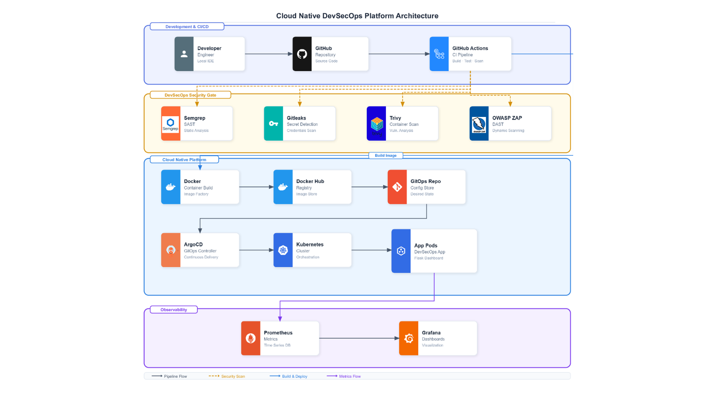

# Cloud Native DevSecOps Control Center

<p align="center">


</p>


<h3 align="center">
A Cloud Native DevSecOps platform implementing secure CI/CD, GitOps deployment, container security, and Kubernetes operations.
</h3>


---

# Overview

The **Cloud Native DevSecOps Control Center** is a production-inspired platform designed to demonstrate a complete modern software delivery lifecycle.

The project combines:

- Secure application development
- Automated security testing
- Containerization
- Kubernetes deployment
- Helm packaging
- GitOps continuous delivery
- Runtime monitoring


The goal is to demonstrate how an application moves from source code to a Kubernetes workload while integrating security practices throughout the lifecycle.


---

# Architecture

# Technology Stack


<p align="center">


</p>


| Category | Technology |
|-|-|
| Application | Python, Flask |
| Containerization | Docker |
| Orchestration | Kubernetes |
| Deployment Packaging | Helm |
| GitOps | ArgoCD |
| CI/CD | GitHub Actions |
| Metrics | Prometheus |
| Visualization | Grafana |
| Registry | Docker Hub |


---

# Application Features


## DevSecOps Dashboard

The application provides a Cloud Native dashboard displaying:

- Application health status
- Kubernetes runtime information
- Deployment information
- Security pipeline results
- Container information
- Build metadata


The dashboard retrieves information dynamically through backend APIs.


---

# Application Endpoints


## Health Endpoint

```
GET /health
```


Example response:


```json
{
  "status": "healthy",
  "application": "cloud-native-security-platform",
  "environment": "kubernetes",
  "deployment": "argocd",
  "hostname": "pod-name"
}
```


---

## Version Endpoint

```
GET /version
```


Provides application build information:

```json
{
  "version": "commit-sha",
  "branch": "main",
  "build_date": "timestamp",
  "hostname": "pod-name"
}
```


---

## Security Pipeline Endpoint

```
GET /pipeline
```


Example:

```json
{
  "SAST": "Semgrep PASSED",
  "Secrets": "Gitleaks PASSED",
  "Container": "Trivy PASSED",
  "DAST": "OWASP ZAP PASSED"
}
```


---

## Prometheus Metrics

```
GET /metrics
```


The application exposes metrics compatible with Prometheus.


---

# DevSecOps CI/CD Pipeline


<p align="center">


</p>


The GitHub Actions pipeline automatically executes security validation before deployment.


Pipeline:


```
Developer Push

      |

      v

GitHub Actions

      |

      +--> Semgrep SAST

      |

      +--> Gitleaks Secret Detection

      |

      +--> Trivy Container Scan

      |

      +--> Docker Build

      |

      +--> Docker Push

      |

      +--> OWASP ZAP DAST

      |

      v

Kubernetes Deployment
```


---

# Security Implementation


## Static Application Security Testing (SAST)

Tool:

```
Semgrep
```


Purpose:

- Detect insecure coding patterns
- Identify vulnerabilities
- Apply security rules automatically


---

## Secret Detection

Tool:

```
Gitleaks
```


Purpose:

- Detect exposed credentials
- Prevent secret leaks
- Protect repository history


---

## Container Security

Tool:

```
Trivy
```


Purpose:

- Scan container filesystem
- Detect vulnerable dependencies
- Improve image security


---

## Dynamic Application Security Testing

Tool:

```
OWASP ZAP
```


Purpose:

- Analyze running application
- Detect web security issues
- Validate deployed environment


---

# Kubernetes Deployment


The application runs on Kubernetes using Helm.


Deployment architecture:


```
Kubernetes Cluster


        |

        |

    Deployment

        |

        |

   ReplicaSet

        |

        |

 +--------------+
 |              |
Pod            Pod

Flask App     Flask App

```


---

# Kubernetes Security Hardening


The deployment applies Kubernetes security best practices.


## Non Root Container


```yaml
securityContext:
  runAsNonRoot: true
  runAsUser: 1000
```


The application runs without root privileges.


---

## Capability Restriction


```yaml
capabilities:
  drop:
    - ALL
```


Linux capabilities are removed to reduce attack surface.


---

## Privilege Escalation Disabled


```yaml
allowPrivilegeEscalation: false
```


Prevents processes from gaining additional privileges.


---

## Resource Management


Configured Kubernetes resources:


```yaml
requests:
  cpu: 100m
  memory: 128Mi

limits:
  cpu: 500m
  memory: 512Mi
```


---

## Health Monitoring


Kubernetes probes:


Readiness:

```
/health
```


Liveness:

```
/health
```


These ensure unhealthy containers are automatically detected.


---

# GitOps Workflow


The project follows GitOps principles using ArgoCD.


```
Git Repository

      |

      v

    ArgoCD

      |

      v

Kubernetes Desired State

      |

      v

Running Application
```


ArgoCD continuously monitors the Git repository and synchronizes Kubernetes resources automatically.


---

# Helm Chart Structure


```
devsecops-demo/

├── Chart.yaml

├── values.yaml

└── templates/

    ├── deployment.yaml

    ├── service.yaml

    └── servicemonitor.yaml

```


---

# Deployment


## Validate Helm Chart


```bash
helm lint devsecops-demo
```


---

## Render Kubernetes Manifests


```bash
helm template devsecops-demo ./devsecops-demo
```


---

## Install


```bash
helm install devsecops-demo ./devsecops-demo
```


---

# Repository Structure


```
devsecops-demo-app/


├── app.py

├── Dockerfile

├── requirements.txt


├── templates/

│   └── index.html


├── static/

│   ├── style.css

│   └── dashboard.js


└── .github/

    └── workflows/

        └── security-pipeline.yml

```


---

# Future Improvements


Planned enhancements:
- Kyverno policy enforcement
- External Secrets Operator
- Cloud deployment
- Argo Rollouts progressive delivery


---

# Skills Demonstrated


This project demonstrates practical experience with:


- Kubernetes administration
- Helm deployment
- GitOps workflows
- CI/CD automation
- DevSecOps implementation
- Container security
- Cloud Native architecture
- Secure Kubernetes deployments


---

# Author


## Wejden Haj Mefteh


Cloud Engineering Student

Interested in:

- Kubernetes
- Cloud Native technologies
- DevOps
- DevSecOps
- Infrastructure Automation

